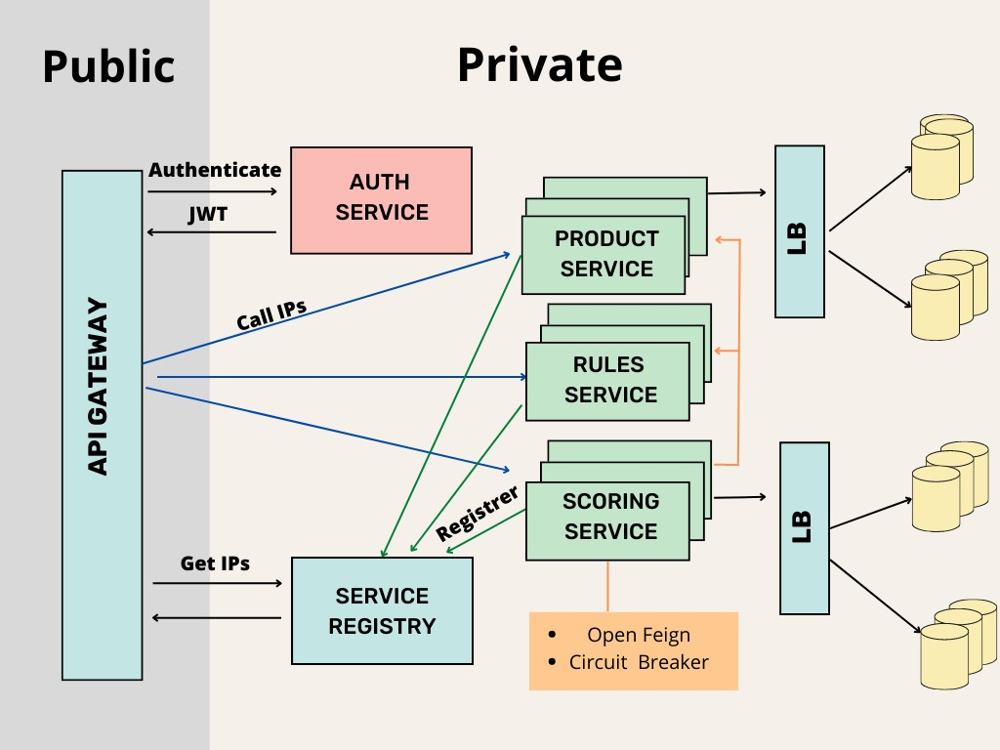
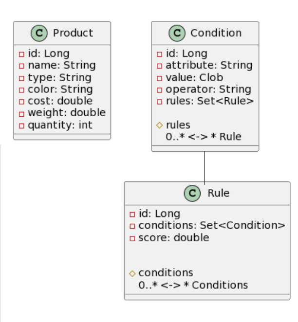

# Matchmaker microservices
**Matchmaker** is a system that helps a company find the best products at the best prices, by matching the products offered by a salesman with the company's set of rules. The system scores each product based on how well it matches the rules, filters the products to only those that pass a certain threshold, and calculates the total and average prices of the matching products. It is designed to be scalable, durable and consistent, able to handle high volumes of data and millions of users.

## Description
This system is split into microservices, allowing for better scalability, fault isolation, and ease of development. Each microservice can be deployed and scaled independently and can quickly add new features and fix bugs without affecting the entire system.

The system design is as follows:

And the description of the services are as follows:

* ###### Auth Service: 
    This service is a centralized authentication and authorization server that will use **JWT (JSON Web Token)** to create and validate the requests.

* ###### API Gateway: 
    This service act as the point of entry for the system. This will route the requests to the corresponding microservices using **Spring Cloud Gateway**.

* ###### Service Discovery: 
    This is the Client-side service discovery allowing the other services to find and communicate with each other without hard-coding the hostname and port using **Spring Cloud Netflix Eureka** which also provides a simple round-robin load balancing solution.
  
* ###### Product Service: 
  This service is responsible for managing products and their attributes, it is responsible for CRUD operations of products, and it also provides an endpoint that can filter products based on the rules.

* ###### Rule Service: 
    This service is responsible for managing the rules, and it provides an endpoint to add, update, delete and retrieve rules.

* ###### Scoring Service: 
    This service is responsible for the calculation functions, it scores the products based on the rules, and calculate the total and average prices of the products. It uses **Spring Cloud OpenFeign** to communicate with the instance of the Product and Rule services registered in the Service Discovery to get the data.

## Communication
As mentioned before, the communication between the services is achieved using **Spring Cloud OpenFeign**, a declarative HTTP client that allows for easy communication between microservices using RESTful APIs, and using **Spring Cloud Netflix Hystrix** to add a layer of fault tolerance when the communication between service fails, so it will open the circuit and forward the call to a fallback method.

## Storage
For the sake of simplicity, this project uses H2 as a database embedded in the Products service and the Rules service, and handles the multiple data type using a CLOB column in the database and a special serializer and deserializer to transform to the respective type. However, in a real-life scenario where different data types is expected and a high volume of data needs to be managed, with more reads than writes with the need of easy scalability, I would recommend using a NoSQL database like a **MongoDB**, which is a document database where is not require data to fit into a rigid structure of relational rows and columns, storing all related data together within a single document. Additionally, it would be beneficial to partition the Products database into categories and the Rules database by scores, using a **Shared Database Pattern**.

So the simple storage model for the H2 will be like

## Consuming
To consume the service, the Postman JSON collection "Context Lab.postman_collection.json" can be used, which has the different requests for:
* Authentication
* Products CRUD
* Rules CRUD 
* Score calculation

As every service and request is secured but the login authentication, you should start by requesting the Get Token ("http://localhost:8080/api/v1/auth/login"") with the test credentials:

{
"username": "test",
"password" : "test"
}

The rest of the JSON and request endpoints can be found in the Postman collection.

